# My Blog

My Blog 是由 SpringBoot + Mybatis + Thymeleaf 等技术实现的 Java 博客系统，页面美观、功能齐全、部署简单及完善的代码，一定会给使用者无与伦比的体验，如果觉得这个项目不错，可以为它[点赞](https://github.com/ZHENFENG13/My-Blog/stargazers)支持。

- **你可以拿它作为博客模板，因为 My Blog 界面十分美观简洁，满足私人博客的一切要求；**
- **你也可以把它作为 SpringBoot 技术栈的学习项目，My Blog也足够符合要求，且代码和功能完备；**
- **内置三套博客主题模板，主题风格各有千秋，满足大家的选择空间，后续会继续增加，以供大家打造自己的博客；**
- **技术栈新颖且知识点丰富，学习后可以提升大家对于知识的理解和掌握，对于提升你的市场竞争力有一定的帮助。**

## 注意事项

- **数据库文件目录为```static-files/my_blog_db.sql```；**
- **部署后你可以根据自己需求修改版权文案、logo图片、备案记录等网站基础信息；**
- **My Blog 还有一些不完善的地方，鄙人才疏学浅，望见谅；**
- **有任何问题都可以反馈给我，我会尽量完善该项目。**

演示站点：http://13blog.site

[](https://travis-ci.org/ZHENFENG13/My-Blog)

[](https://github.com/ZHENFENG13/My-Blog/blob/master/LICENSE)

## 联系作者

> 大家有任何问题或者建议都可以在 [issues](https://github.com/ZHENFENG13/My-Blog/issues) 中反馈给我，我会慢慢完善这个项目。

- 我的邮箱：2449207463@qq.com
- QQ技术交流群：796794009 881582471 658365129(已满)

## 效果预览

### 后台管理页面

- 登录页

	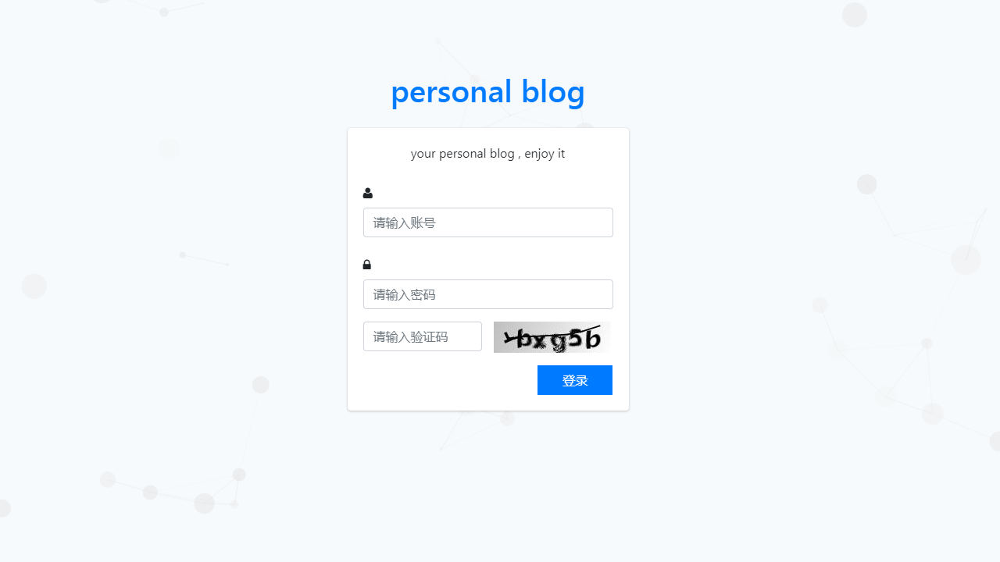

- 后台首页

	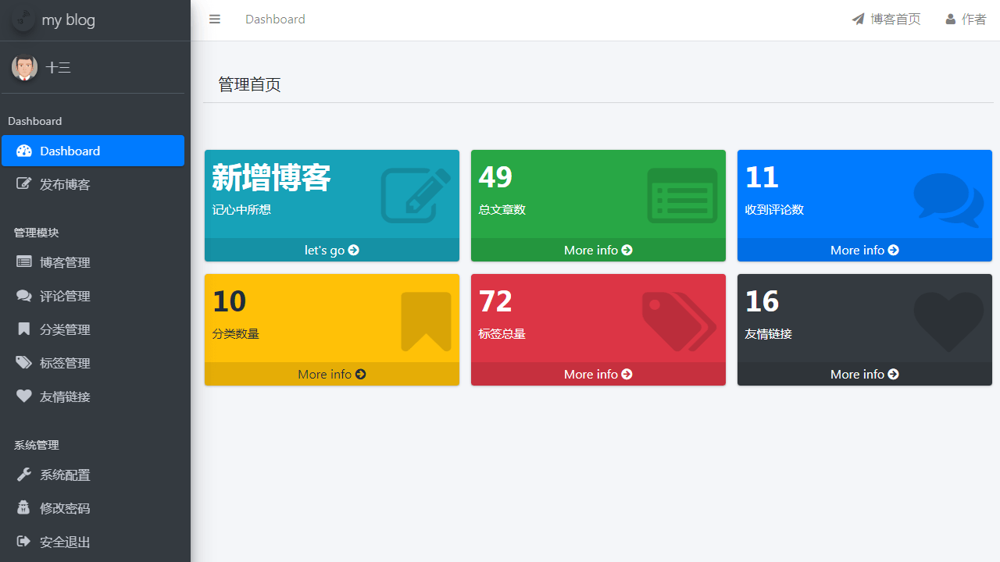

- 文章管理

	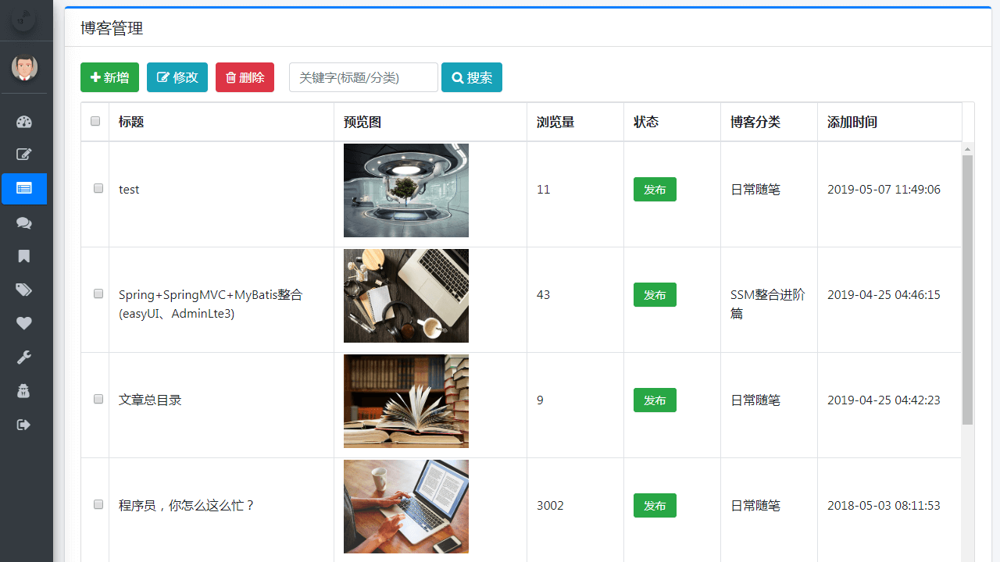

- 文章编辑

	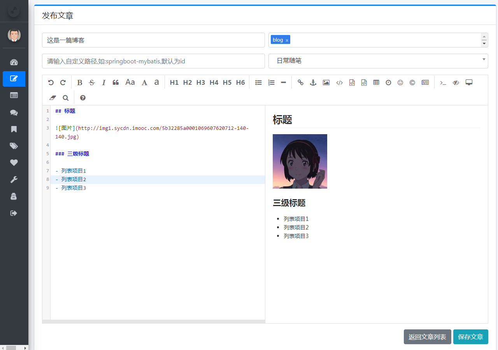

- 评论管理

	

- 系统配置

	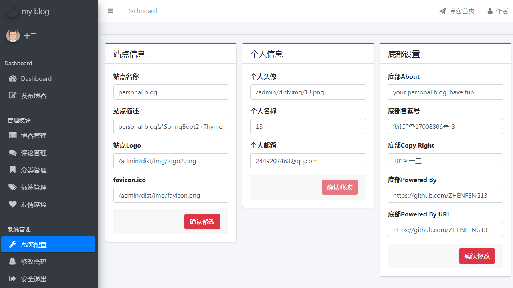

### 博客展示页面

开发时，在项目中**内置了三套博客主题模板，主题风格各有千秋**，效果如下：

#### 模板一

- 首页

	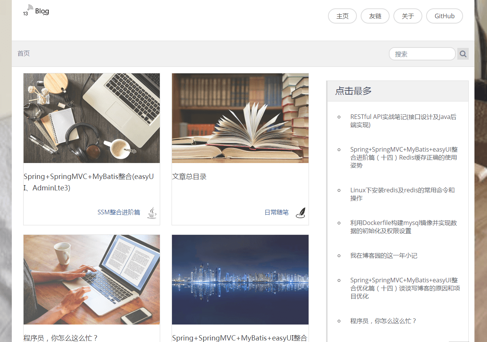

- 文章浏览

	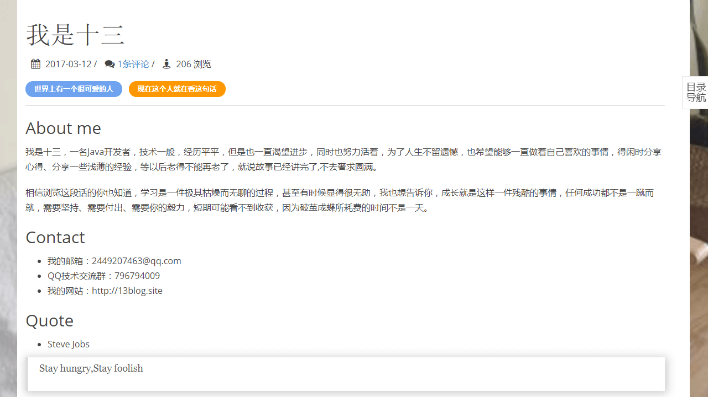

- 友情链接

	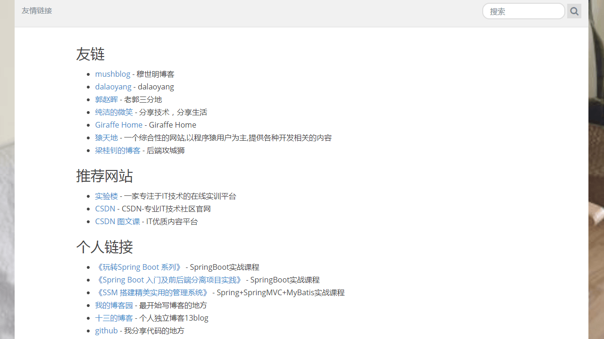

#### 模板二

- 首页

	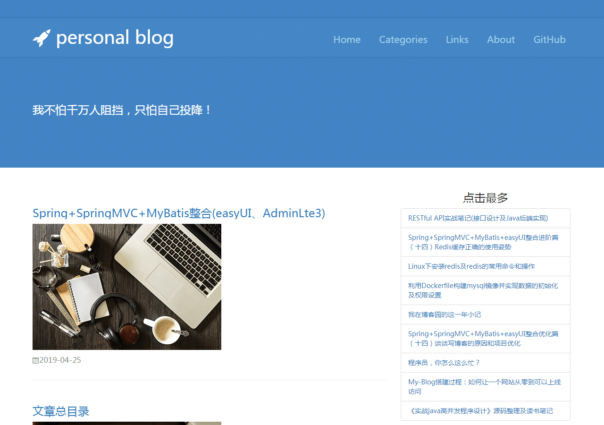

- 文章浏览

	

- 友情链接

	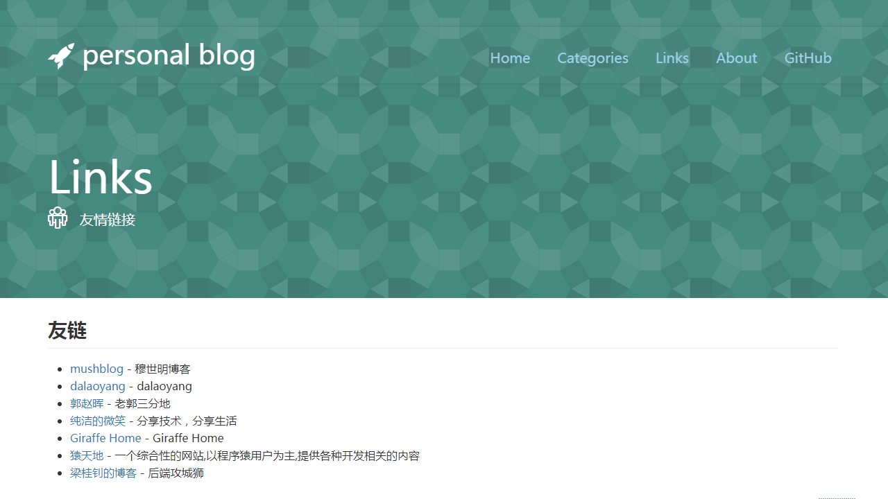

#### 模板三

- 首页

  

- 文章浏览

  

- 友情链接

  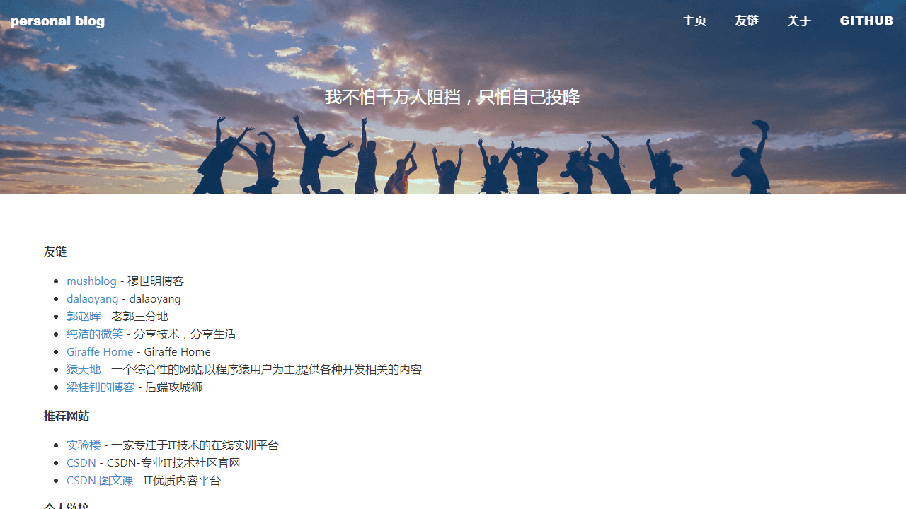